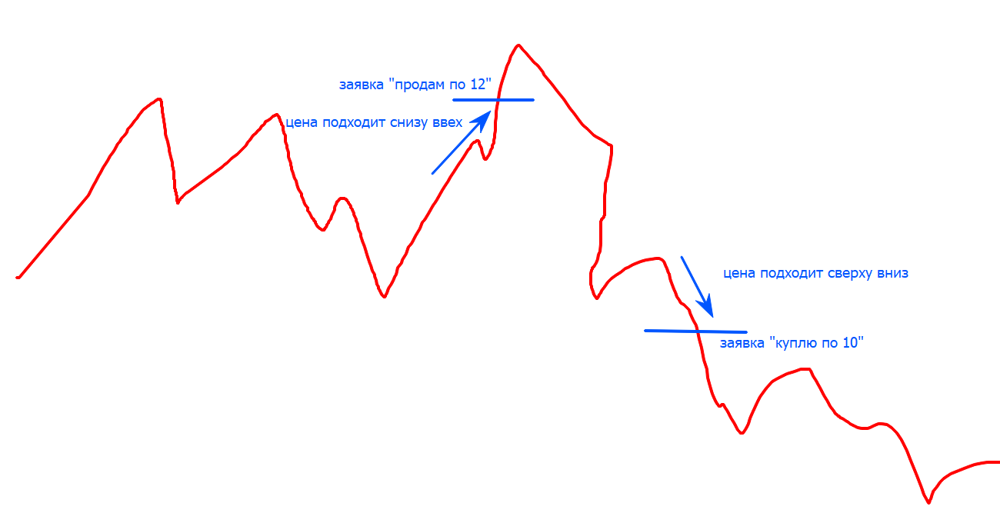
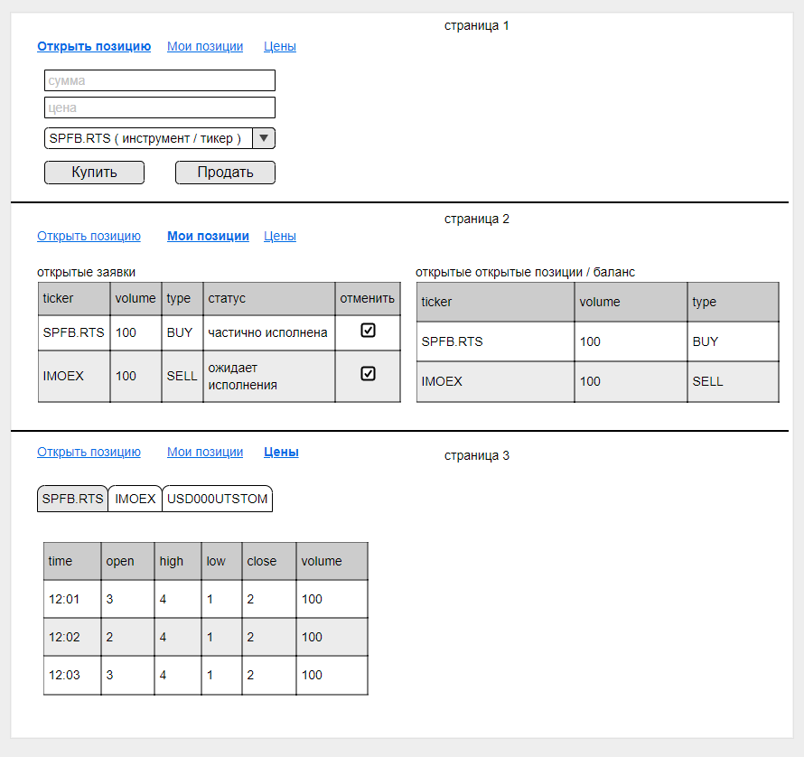

# Хакатон по курсу golang

Пишем биржу :)


`Биржа` состоит из 3-х компонентов:

- `Клиент`
- `Брокер`
- `Биржа`

## `Биржа`

`Биржа` - центральная точка всей системы. Она сводит между собой различных продавцов и покупателей из разных брокеров, результатом сделок которых является изменение цены. пример биржи из жизни - москвская, питерская, нью-йоркская, forex.

В нашем хакатоне будут использоваться исторические данные реальных торгов по фьючерсным контрактам на бирже РТС за 2024-05-06 - лежат в папке `price_data` (данные были взяты [отсюда](https://www.finam.ru/profile/mosbirzha-fyuchersy/si/export/?market=14&em=19899&token=03AGdBq27txH5F70kV3jxA-cLllPcgOpFyL1asvxW5CCMA644K_ZKsbHnhQEBxYrF20qXiSTfjtxDhqZ21EpjT2G_tQPhKWa4nUlAsBYZdxB5lqqqC5195o5NrHDkORvTiYIj_JT1dOhMKm0NnNRYWIElx6PFP7Vt0vtplRZBne0MdXqiJCl8-13MmV61d3RcnBY9AZ2UAUr6qoPNBw5rMzOtwiykDqxZHHelIUG1R1sjZb3rl0oyE3QauSp333zL0zKoJ7OBf1YRaotghLfYOgDoyvCtQ3P8nUQdXHUSI9_rUGsBrqF2xV2bp_4WVX9jgPusLBjbbmxHSKErfLfCFiqr3DmiOBblSgymcZXYl0k-NZDCjyLvL0ozreZ-BBTK5xL99yLl8ptXqAvJIx3T5R2ZlZO1MTGcRAErpAZxku1D2-qImPyJO6jGhT5a1rzgmn2UfPnA5KpDY&code=Si&apply=0&df=24&mf=1&yf=2022&from=24.02.2022&dt=24&mt=1&yt=2022&to=24.02.2022&p=1&f=Si_220224_220224&e=.txt&cn=Si&dtf=1&tmf=1&MSOR=1&mstime=on&mstimever=1&sep=1&sep2=1&datf=6&at=1))

Формат данных `<TICKER>;<PER>;<DATE>;<TIME>;<LAST>;<VOL>`:

- TICKER - название торгуемого инструмента
- PER - период, у нас тики ( отдельные сделки ), игнорируйте это поле
- DATE - дата
- TIME - время
- LAST - цена прошедшей сделки
- VOL - объём продшей сделки

Если на биржу ставится заявка на покупку или продажу, то она ставится в очередь и когда цена доходит до неё и хватает объёма - заявка исполняется, брокеру уходит соответствующее уведомление. Если не хватает объёма, то заявка исполняется частичсно, брокеру так же уходит уведомление.
Если несколько участников поставилос заявку на одинаковый уровеньт цены, то исполняются в порядке добавления.

Внутри биржи цена образует книгу заявок, то что называется стаканом - это на каком уровне стоят заявки на покупку или продажу


или более информативно


В связи с тем что наши данные исторические - предполагем, что мы не можем выступить инициатором сделки (т.е. сдвинуть цену, купив по рынку), можем приобрести только если другая сторона выступила инциатором. Это значит что мы встаём в стакан и когда цена доходит до нас - происходит сделка.

Заявки могут быть 2 видов:

- на прокупку - "я хочу купить по цене Х" - когда цена сверху вниз доходит до нашей заявки - она исполняется
- на продажу - "я хочу продать по цене Х" - когда цена снизу вверх доходит до нашей заявки - она исполняется
- визуально это выглядит так  или более честно так 

Помимо исполнения сделок биржа транслирует цену инструментов всем подключенным брокерам. Список транслируемых инструментов берётся из конфига, сами цены - из файла.
В связи с тем что цены исторические - мы не смотрим на дату, а считаем время относительно первой даты в файле. Инфомрация о изменении цены отправляется каждую секунду. Если в секунду ( под конфигом) произошло больше чем 1 сделка - они аггрегируются. Брокеру отправляется OHLCV ( open, high, low, close, volume ), где:

- open - цена открытия интервала (первая сделка)
- high - максимальная цена в интервале
- low - минимальная цена в интервале
- close - цена закрытия интервала ( последняя сделка )
- volume - количество проторгованных контрактов

Формат обмена данными с брокером - protobuf через GRPC

```protobuf
syntax = "proto3";
option go_package = "./;exchange"; 

message OHLCV {
  int64 ID = 1; // внутренний идентификатор, просто авто-инкремент
  uint32 Time = 2;
  int32 Interval = 3; // в данном случае - 1 секунда
  float Open = 4;
  float High = 5;
  float Low = 6;
  float Close = 7;
  string Ticker = 8;
  float Volume = 9;
}

message Deal {
    int64 ID = 1; // DealID который вернулся вам при простановке заявки
    int64 Type = 2; // тип заявки. покупка/продажа
    int64 BrokerID = 3;
    int64 ClientID = 4;
    string Ticker = 5;
    int32 Amount = 6; // сколько купили-продали
    bool Partial = 7; // флаг что сделка клиента исполнилсь частично
    uint32 Time = 8;
    float Price = 9;
}

message DealID {
    int64 ID = 1;
    int64 BrokerID = 2;
}

message BrokerID {
    int64 ID = 1;
}

message CancelResult {
    bool success = 1;
}

service Exchange {
    // поток ценовых данных от биржи к брокеру
    // мы каждую секнуду будем получать отсюда событие с ценами, которые броке аггрегирует у себя в минуты и показывает клиентам
    // устанавливается 1 раз брокером
    rpc Statistic (BrokerID) returns (stream OHLCV) {}

    // отправка на биржу заявки от брокера
    rpc Create (Deal) returns (DealID) {}

    // отмена заявки
    rpc Cancel (DealID) returns (CancelResult) {}

    // исполнение заявок от биржи к брокеру
    // устанавливается 1 раз брокером и при исполнении какой-то заявки 
    rpc Results (BrokerID) returns (stream Deal) {}
}

```

## `Брокер`

`Брокер` - это организация, которая предсотавляет своим клиентам доступ на биржу.
У неё есть список клиентов, которые могут взаимодействовать посредством неё с биржей, так же она хранит количество их позиицй и историю сделок.
пример брокера из жизни - тинькоф инвестиции, альфа банк, открытие, втб ...

`Брокер` аггрегирует внутри себя информацию от биржи по ценовым данным, позволяя клиенту посмотреть историю. По-умолчанию, хранится история за последнеи 5 минут (300 секунд).

! смотрите сначала скрин у клиента

`Брокер` предоставляет клиентам JSON-апи (REST или JSON-RPC) или же grpc-апи ( отдельный proto-файл от того что у биржи ), через который им доступныы следующие возможности:

- посмотреть свои позиции и баланс - возвращает баланс + список заявок ( слайс структур ), может быть преобразовано в таблицу на хтмл

```json
-> GET /api/v1/status

<-
{
    "body": {
        "balance": 10000000,
        "positions": [
            {"ticker": "RTS", ... }
        ],
        "open_orders": [
            {"id": 123, "ticker": "RTS", ... }
        ]
    }
}
```

- отправить на биржу заявку на покупку или продажу тикера ( то что вы видите на скрине у клиента )

```json
-> POST /api/v1/deal
{
    "deal": {
        "ticker": "RTS",
        "type": "BUY",
        "amout": 100,
        "price": 11
    }
}

<-
{
    "body": {
        "id": "123"
    }
}
```

- отменить ранее отправленную заявку - принимает ИД заявки

```json
-> POST /api/v1/cancel
{
    "id": 123
}

<-
{
    "body": {
        "id": "123",
        "status": ...
    }
}
```

- посмотреть последнюю истории торгов - возвращает слайс структур, может быть преобразовано в таблицу на хтмл

```json
-> /api/v1/history?ticker=RTS

<-
{
    "body": {
        "ticker": "RTS",
        "prices": [
            {"open": ...},
            ...
        ]
    }
}
```

кратко структура базы:

заренее продумывайте все корнеркейсы мапинга данных из структур в базу и наоборот. какие-то поля могут быть пустыми, где-то в базе может быть null.

```sql
CREATE TABLE `clients` (
    `id` int NOT NULL AUTO_INCREMENT PRIMARY KEY,
    `login` varchar(300) NOT NULL,
    -- `password` varchar(300) NOT NULL,
    `balance` int NOT NULL
);

-- INSERT INTO `clients` (`id`, `login`,  `password`, `balance`) 
--     VALUES (1, 'Vasily', '123456', 200000),
--     VALUES (2, 'Ivan', 'qwerty', 200000),
--     VALUES (3, 'Olga', '1qaz2wsx', 200000);

CREATE TABLE `positions` (
    `id` int NOT NULL AUTO_INCREMENT PRIMARY KEY,
    `user_id` int NOT NULL,
    `ticker` varchar(300) NOT NULL,
    `vol` int NOT NULL,
    KEY user_id(user_id)
);

-- INSERT INTO `clients` (`user_id`, `ticker`, `amount`) 
--     VALUES (1, 'SiM7', '123456', 200000),
--     VALUES (1, 'RIM7', '123456', 200000),
--     VALUES (2, 'RIM7', 'qwerty', 200000);
    
CREATE TABLE `orders_history` (
    `id` int NOT NULL AUTO_INCREMENT PRIMARY KEY,
    `time` int NOT NULL,
    `user_id` int,
    `ticker` varchar(300) NOT NULL,
    `vol` int NOT NULL,
    `price` float not null,
    `is_buy` int not null,
    KEY user_id(user_id)
);

CREATE TABLE `request` ( -- запросы
    `id` int NOT NULL AUTO_INCREMENT PRIMARY KEY,
    `user_id` int,
    `ticker` varchar(300) NOT NULL,
    `vol` int NOT NULL,
    `price` float NOT NULL,
    `is_buy` int not null, -- 1 - покупаем, 0 - продаем
    KEY user_id(user_id)
);


CREATE TABLE `stat` ( -- запросы
    `id` int NOT NULL AUTO_INCREMENT PRIMARY KEY,
    `time` int,
    `interval` int,
    `open` float,
    `high` float,
    `low` float,
    `close` float,
    `volume` int,
    `ticker` varchar(300),
    KEY id(id)
);
```

## `Клиент`

`Клиент` - это любой пользователь АПИ брокера. Это может быть биржевой терминал, веб-сайт, торговый робот. пример клиента из жизни - мобильное приложение тинькоф инфестици, веб сайт с интерфейсом торговли втб банка.  

Мы делаем простой биржевой терминал на хтмл, который нам позволяет покупать-продавать, смотреть свою историю и информацию о котировках.

 ( там 3 разные вкладки )

Не заморачивайтесь с интерфейсом!

- Таблицы уже выводились в примерах курса, скопируйте код оттуда и подставьте свои поля
- Формы тоже были
- По кнопке "отменить" на биржу уходит запрос Cancel черех брокера
- не обязательно повторять интерфейс 1 в 1, достаточно чтобы оно просто работало
- использовать какие-то js фреймворки запрещено. только Server Side Rendering на шаблонах

# Организация работы

Обсуждаем проект, делимся на команды, пишем код. 3 компонента, 3 команды. Работам короткими этапами по 45 минут, стараясь в конце этапа иметь логически завершенный кусок.

Каждая команда мерджит свой компонент в мастер, если считает что всё будет рабоать.

Проект делать через го модули и со структурой как в реддите.

`Биржа` - самый сложный компонент. Рекомендую его сначала замокать, чтобы выдавал "ок", а потом добивать.

Прежде чем начать яростно кодить - вспомните предыдущий хакатон. Как там всё прошло, какие были затыки и что можно сделать лучше.

# Порядок работы

0. обсудить задачу в целом
1. выбрать координаторов/тимлидов, которые будут отвечать за взаимодействие между группами и общий успех
2. разбиться на группа
3. обсудить задачу группы
4. обсудить протоколы общения с взаимодействующими компонентами ( т.е. worker обсуждает протокол с web, а так же формат данных с writer; writer - формат данных на диске с worker, формат приёма данных с emiter )
5. начинать писать код

внимание❗️

- делать надо начинать с MVP (minimum viable product). если будете делать все сразу, то ничего не успеете и оно не заведется
  - сначала сделать stat и отображение инфы о котировках, а потом уже допиливать торговлю и работу с заявками
  - сначала поддержать Si, а потом уже RTS
- если не будет координатора/тимлида - будет хаотичная разработка и в итоге ничего не заработает
- если вы не договоритесь о форматах и прочем, а сразу же броситесь писать код - в итоге выяснится, что компоненты между собой не совместимы и ничего не работает
- если вы начнете интегрироваться в конце - скорее всего ничего не заработает. интеграцию надо или начинать с самого начала, или, хотя бы, в середине дня

проверено :)

писать код лучше в режиме парного-тройного программирования, периодически меняясь у клавиатуры

# Деплой

❗️это надо делать когда уже все готово и работает локально.

помимо того, что разработать, надо еще и выложить ваш код куда-то и запустить там для демонстрации. под эту задачу мы выделили вам по одной виртуалке на каждую команду, на которых в конце дня должены быть подняты все компоненты вашего сервиса.

как ssh-нуться в виртуалку:
    chmod 600 vm_access_key.pem (это надо один раз сделать чтоб изменить права доступа)
    ssh -i vm_access_key.pem <ваш логин gitlab>@< ip виртуалки>
как закинуть файл на виртуалку:
    scp <файл> <ваш логин gitlab>@< ip виртуалки>:~/

адреса Виртуалок:
    TBD - создам их в процессе хакатона

пароль для судо dsuyuyduaudijijhugvydsuyuyduaudijijhugvy

# После хакатона

так же вам надо будет заполнить отчет по результатам хакатона и ответить на следущие вопросы

1. над каким компонентом вы работали, что именно вы писали
2. кто работал вместе с вами в команде
3. с какими проблемами/трудностями вы встрелились (любого характера)
4. какие знания вам пригодились, какие знания вы применяли
5. каких знаний вам не хватило и пришлось быстро гуглить, читатть доку, разбираться
6. что получилось, почему?
7. что не получилось, почему?
8. что лично вы могли бы сделать лучше в следующий раз
9. что вы, как команда, могли бы сделать лучше в следующий раз

отчет надо оформить в файлик `hakaton.md` и закоммитить в свой репозиторий с лекциями, где вы обычно решаете домашки. а потом как обычно скинуть МР в личку

без отчета баллы не выставляется
